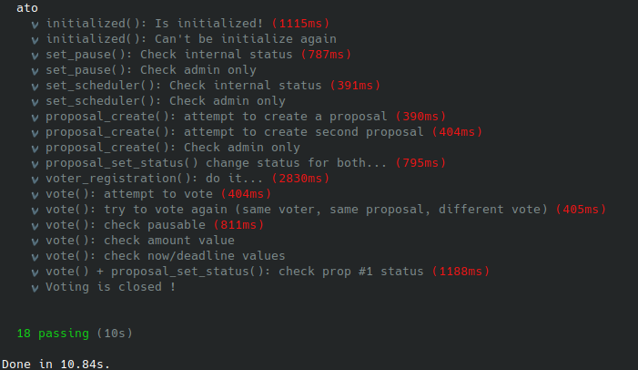

# ATO : Autonomous Trading Organization

## Overview

### Components

1. Program & instructions
    - **DAO Initialization**: Initialize the DAO with the necessary configuration.
    - **Setting scheduler key**: Set the scheduler public key (used for vote checking).
    - **Pausable mode**: Pausable mode, to "freeze" the DAO.
    - **Create Proposal**: Create a new proposal for voting.
    - **Voter registration**: Register members as eligible voters.
    - **Change proposal status**: Update the status of proposals.
    - **Vote on Proposal**: Allow members to vote on the proposals.
    
2. Accounts
    - **DAO Base Account**: Stores the overall state of the DAO including indexes of voters and proposals.
    - **Proposal Account**: Represents an individual proposal.
    - **Voter Account**: Represents an individual voter in the DAO.
    - **Vote Account**: Represents an individual vote by a voter on a proposal.

3. Structures, associated to accounts

    **Proposal**
    ```rust
    pub struct AtoProposal {
      pub signer         : Pubkey,
      pub deadline       : u64,
      pub threshold      : u64,
      pub amount         : u64,
      pub vote_yes       : u16,
      pub vote_no        : u16,
      pub vote_index_tail: u16,
      pub index          : u16,
      pub title          : [u8; STR_SIZE_TITLE],
      pub description    : [u8; STR_SIZE_DESCR],
      pub mode           : u8,
      pub status         : u8,
      pub trade          : u8,
    }
    ```

    **Voter**
    ```rust
    pub struct AtoVoter {
      pub voter: Pubkey,
      pub index: u16,
      pub name : [u8; STR_SIZE_NAME],
      pub email: [u8; STR_SIZE_EMAIL],
    }
    ```

    **Vote**
    ```rust
    pub struct AtoVote {
      pub voter         : Pubkey,
      pub amount        : u64,
      pub timestamp     : u64,
      
      pub proposal_index: u16,
      pub voter_index:    u16,
      pub vote_index:     u16,
    
      pub vote          : bool,
      // false = no
      // true  = yes
    
    }
    ```

4. Macros

    **compute_fn!**
    ```rust
    macro_rules! compute_fn {
      ($msg:expr=> $($tt:tt)*) => {
        anchor_lang::solana_program::msg!(concat!($msg, " {"));
        anchor_lang::solana_program::log::sol_log_compute_units();
        let res = { $($tt)* };
        anchor_lang::solana_program::log::sol_log_compute_units();
        anchor_lang::solana_program::msg!(concat!(" } // ", $msg));
        res
      };
    }
    ```
    It allows you to measure and log the compute units consumed before and after the execution of a block of code.

    **admin_only!**
    ```rust
    macro_rules! admin_only {
      ($ctx:expr) => {{
        let ato_data = &mut $ctx.accounts.ato_data;
        let signer = &$ctx.accounts.signer;
        require_eq!(ato_data.admin, signer.key(), AtoError::AdminOnly);
      }};
    }
    ```
    It allow to check the rule for administrator role.

    **scheduler_only!**
    ```rust
    macro_rules! scheduler_only {
      ($ctx:expr) => {{
        let ato_data = &mut $ctx.accounts.ato_data;
        let signer = &$ctx.accounts.signer;
        require_eq!(ato_data.scheduler, signer.key(), AtoError::SchedulerOnly);
      }};
    }
    ```
    It allow to check the rule for scheduler role.

    **pausable!**
    ```rust
    macro_rules! pausable {
      ($ctx:expr) => {{
        let ato_data = &mut $ctx.accounts.ato_data;
        require_eq!(ato_data.paused, false, AtoError::ProgramPaused);
      }};
    }
    ```
    It allow to check if program is on "pause" mode.

    **string_to_u8!**
    ```rust
    macro_rules! string_to_u8 {
      ($string:expr, $storage_title:expr) => {{
        let bytes: &[u8] = $string.as_bytes();
        let len = bytes.len().min($storage_title.len());
        $storage_title[..len].copy_from_slice(&bytes[..len]);
        //$storage_title
      }};
    }
    ```
    The macro is useful when you need to store string data in a fixed-size array or of `u8` values. This is often required in environments like **Solana smart contracts** where fixed-size buffers are used for efficiency and compatibility with on-chain data structures.

    **check_index!**
    ```rust
    macro_rules! check_index {
      ($index:expr) => {{
        require_gt!(ATO_INDEX_MAX, $index, AtoError::OutOfBoundIndex);
      }};
    }
    ```
    Essentially, this macro is a shorthand to check that a given index is within acceptable bounds, specifically less than **ATO_INDEX_MAX**, and to handle the error case cleanly if it is not.

### Purpose
The purpose of this project is to create a DAO on the Solana blockchain where administrators can propose and members can propose and vote on different proposals. The voting can be triggered based on a time duration or a threshold value obtained from an oracle.

### Testing the DAO
The project includes tests using `web3.js` and `chai` to ensure the functionalities work as expected. Example test scenarios include initializing the DAO, adding voters, creating and voting on proposals (and checking the results).


## Code structure

```bash
.
├── app
├── migrations
│   └── deploy.ts
├── programs
│   └── ato
│       ├── src
│       │   ├── instructions
│       │   │   ├── initialize.rs
│       │   │   ├── mod.rs
│       │   │   ├── proposal_check.rs
│       │   │   ├── proposal_create.rs
│       │   │   ├── proposal_set_status.rs
│       │   │   ├── set_pause.rs
│       │   │   ├── set_scheduler.rs
│       │   │   ├── voter_registration.rs
│       │   │   └── vote.rs
│       │   ├── constants.rs
│       │   ├── errors.rs
│       │   ├── lib.rs
│       │   ├── macros.rs
│       │   └── states.rs
│       ├── Cargo.toml
│       └── Xargo.toml
├── tests
│   └── ato.ts
├── Anchor.toml
├── Cargo.lock
├── Cargo.toml
├── package.json
├── README.md
├── tests_local_deploy.png
├── tsconfig.json
└── yarn.lock

7 directories, 26 files
```


## Launch

### Local validator

`solana-test-validator --reset`

⚠️ Beware it creates local files and directories at the current working directory.


### Real-time logs display

`solana logs`


### Local deploy and launch tests

`anchor test --skip-local-validator`




## Versions

``` 
rustc 1.79.0 (129f3b996 2024-06-10)
cargo 1.79.0 (ffa9cf99a 2024-06-03)
solana-cli 1.18.17 (src:b685182a; feat:4215500110, client:SolanaLabs)
anchor-cli 0.29.0
yarn 1.22.19
node v18.16.0
npm 9.6.7
``` 

`cargo build-sbf -V`
```
solana-cargo-build-sbf 1.18.17
platform-tools v1.41
rustc 1.75.0
```

## Resources

- **GitHub**:
  - [AutonomousTradingOrganization · GitHub](https://github.com/AutonomousTradingOrganization)
  - [Laugharne (Laugharne) · GitHub](https://github.com/Laugharne)
  - [Boyquotes · GitHub](https://github.com/Boyquotes)
- **Documentation**: [GitHub - AutonomousTradingOrganization/Documentation](https://github.com/AutonomousTradingOrganization/documentation)
- **Miro**: [Miro | The Visual Workspace for Innovation](https://miro.com/app/board/uXjVK0d8Its=/)